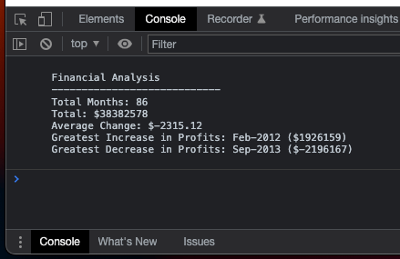

# Unit 4 Challenge: Console Finances

## Description

Given a financial dataset describing a company's monthly Profit/Loss, compute a financial analysis and display it in a web browser's console.

The financial analysis includes:
- The total number of months covered
- The net total Profit/Loss over the entire period
- The average of the monthly changes in Profit/Loss
- The month that had the greatest increase in profits from the month before, and the amount of this increase
- The month with the greatest decrease in profits from the month before, and the amount of this decrease

In working on this project, I applied some of the knowledge gained on JavaScript basics, including how to retrieve data from nested arrays using `for` loops, template literals and rounding numbers.

## Installation

N/A

## Usage

The financial analysis can be accessed by right-clicking the webpage below in a browser, selecting the 'Inspect' option, and then the 'Console' tab.

https://shisinbin.github.io/console-finances/

The financial dataset can be found in the `index.js` file.

A screenshot of the console's output is shown below.

## Credits

N/A

## License

Licensed under the [MIT](https://opensource.org/licenses/MIT) license.

## Badges

